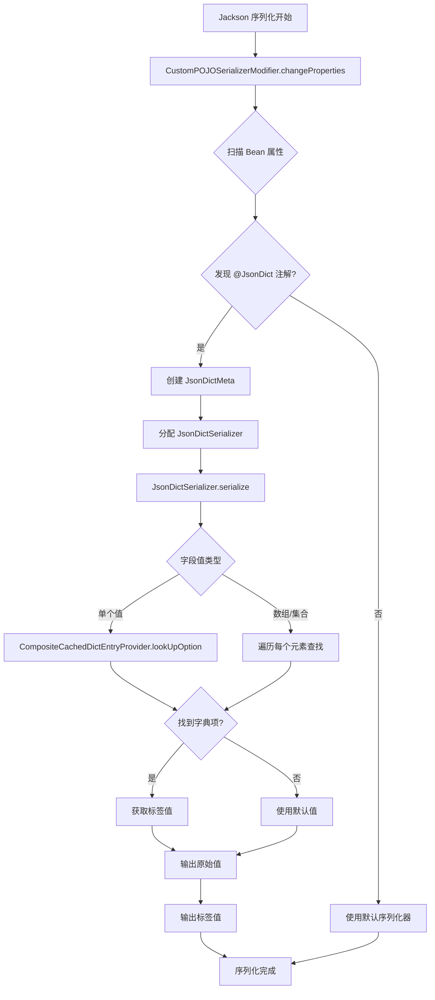

# JsonDict 注解使用指南

## 概述

`@JsonDict` 注解用于在 Jackson 序列化时自动为字典字段添加对应的标签字段。通过该注解，可以在序列化 JSON 时自动将字典值（如 `1`、`"ACTIVE"`）转换为可读的标签（如 `"启用"`、`"激活"`），无需手动编写转换逻辑。

### 核心功能

1. **自动序列化**：在序列化时自动为字典字段添加标签字段
2. **类型支持**：支持单个值、数组、集合等多种数据类型
3. **灵活配置**：支持自定义标签字段名、默认值、大小写敏感等配置
4. **性能优化**：使用缓存机制提升字典查找性能

### 适用场景

- 前后端分离项目中，后端返回字典值需要同时返回可读标签
- 报表导出时需要在数据中包含字典标签
- API 响应中需要同时包含字典值和标签，减少前端转换逻辑

## 注解属性详解

`@JsonDict` 注解定义在 `top.sephy.infra.jackson.annotation.JsonDict`，包含以下属性：

| 属性 | 类型 | 必填 | 默认值 | 说明 |
|------|------|------|--------|------|
| `type` | `String` | ✅ | - | 字典类型，用于标识字典的唯一类型 |
| `labelFieldName` | `String` | ❌ | `""` | 标签字段名，为空时自动生成（字段名 + "Label"） |
| `defaultLabelValue` | `String` | ❌ | `""` | 默认标签值，当字典中找不到对应值时使用 |
| `compareWithString` | `boolean` | ❌ | `true` | 是否将字典值转换为字符串后再比较 |
| `caseSensitive` | `boolean` | ❌ | `false` | 字符串比较时是否区分大小写 |
| `labelClass` | `Class<?>` | ❌ | `String.class` | 标签的类型，影响序列化输出格式 |

### 属性说明

#### type（必填）

字典类型标识符，用于从 `CompositeCachedDictEntryProvider` 中查找对应的字典项。必须与 `DictEntryListProvider` 或 `MultiDictEntryListProvider` 中定义的字典类型一致。

```java
@JsonDict(type = "user_status")  // 字典类型
private Integer status;
```

#### labelFieldName（可选）

指定生成的标签字段名称。如果不指定，默认使用原字段名 + "Label"。

```java
// 默认生成 statusLabel
@JsonDict(type = "user_status")
private Integer status;

// 自定义标签字段名
@JsonDict(type = "user_status", labelFieldName = "statusText")
private Integer status;
```

#### defaultLabelValue（可选）

当字典中找不到对应值时的默认标签。如果未设置且找不到值，标签字段将为 `null`。

```java
@JsonDict(type = "user_status", defaultLabelValue = "未知状态")
private Integer status;
```

#### compareWithString（可选）

控制字典值比较方式。当为 `true` 时，会将字典值和字段值都转换为字符串后再比较；当为 `false` 时，使用 `Objects.equals()` 进行对象比较。

```java
// 字符串比较（推荐，兼容性更好）
@JsonDict(type = "user_status", compareWithString = true)
private Integer status;

// 对象比较（类型必须完全匹配）
@JsonDict(type = "user_status", compareWithString = false)
private Integer status;
```

#### caseSensitive（可选）

仅在 `compareWithString = true` 时生效，控制字符串比较是否区分大小写。

```java
// 不区分大小写（默认）
@JsonDict(type = "user_status", caseSensitive = false)
private String status;  // "active" 和 "ACTIVE" 都能匹配

// 区分大小写
@JsonDict(type = "user_status", caseSensitive = true)
private String status;  // 必须完全匹配大小写
```

#### labelClass（可选）

指定标签的类型，影响序列化输出格式。默认为 `String.class`，标签会以字符串形式输出。

```java
// 字符串标签（默认）
@JsonDict(type = "user_status", labelClass = String.class)
private Integer status;
// 输出: {"status": 1, "statusLabel": "启用"}

// 数字标签
@JsonDict(type = "user_status", labelClass = Integer.class)
private Integer status;
// 输出: {"status": 1, "statusLabel": 100}
```

## 使用示例

### 基础用法

最简单的用法，只需要指定字典类型：

```java
@Data
public class UserDTO {
    
    /**
     * 用户状态：1-启用，0-禁用
     */
    @JsonDict(type = "user_status")
    private Integer status;
    
    // 其他字段...
}
```

序列化后的 JSON：

```json
{
  "status": 1,
  "statusLabel": "启用"
}
```

### 自定义标签字段名

使用 `labelFieldName` 自定义标签字段名：

```java
@Data
public class UserDTO {
    
    @JsonDict(type = "user_status", labelFieldName = "statusText")
    private Integer status;
}
```

序列化后的 JSON：

```json
{
  "status": 1,
  "statusText": "启用"
}
```

### 设置默认值

当字典中找不到对应值时，使用默认值：

```java
@Data
public class UserDTO {
    
    @JsonDict(
        type = "user_status", 
        defaultLabelValue = "未知状态"
    )
    private Integer status;
}
```

如果 `status = 99` 在字典中不存在，输出：

```json
{
  "status": 99,
  "statusLabel": "未知状态"
}
```

### 数组类型支持

支持数组类型的字典字段：

```java
@Data
public class UserDTO {
    
    /**
     * 用户角色列表
     */
    @JsonDict(type = "user_role")
    private String[] roles;
}
```

序列化后的 JSON：

```json
{
  "roles": ["admin", "user"],
  "rolesLabel": ["管理员", "普通用户"]
}
```

### 集合类型支持

支持 `List`、`Set` 等集合类型：

```java
@Data
public class UserDTO {
    
    @JsonDict(type = "user_role")
    private List<String> roles;
    
    @JsonDict(type = "user_permission")
    private Set<Integer> permissions;
}
```

### 大小写敏感配置

对于字符串类型的字典值，可以配置大小写敏感：

```java
@Data
public class UserDTO {
    
    // 不区分大小写（默认）
    @JsonDict(type = "user_status", caseSensitive = false)
    private String status;  // "active"、"ACTIVE"、"Active" 都能匹配
    
    // 区分大小写
    @JsonDict(type = "user_status", caseSensitive = true)
    private String status;  // 必须完全匹配大小写
}
```

### 复杂示例

综合使用多个属性的示例：

```java
@Data
public class OrderDTO {
    
    /**
     * 订单状态
     */
    @JsonDict(
        type = "order_status",
        labelFieldName = "statusText",
        defaultLabelValue = "未知",
        compareWithString = true,
        caseSensitive = false
    )
    private Integer status;
    
    /**
     * 支付方式列表
     */
    @JsonDict(
        type = "payment_method",
        defaultLabelValue = "其他"
    )
    private List<String> paymentMethods;
    
    // 其他字段...
}
```

## 工作原理

### 序列化流程

`@JsonDict` 注解的序列化流程分为两个阶段：

1. **配置阶段**：`CustomPOJOSerializerModifier` 扫描 Bean 属性，发现带有 `@JsonDict` 注解的属性
2. **执行阶段**：`JsonDictSerializer` 执行实际的序列化操作，查找字典标签并输出



### 核心组件

#### CustomPOJOSerializerModifier

`CustomPOJOSerializerModifier` 继承自 `BeanSerializerModifier`，在 Jackson 序列化配置阶段工作：

- **职责**：发现和配置
- **功能**：
  - 扫描 Bean 的所有属性
  - 查找带有 `@JsonDict` 注解的属性
  - 为这些属性分配 `JsonDictSerializer`
  - 缓存 `JsonDictMeta` 元数据以提升性能

**关键代码**：

```java
public List<BeanPropertyWriter> changeProperties(...) {
    // 扫描属性，查找 @JsonDict 注解
    for (BeanPropertyWriter beanProperty : beanProperties) {
        JsonDict annotation = beanProperty.getAnnotation(JsonDict.class);
        if (annotation != null) {
            // 分配 JsonDictSerializer
            beanProperty.assignSerializer(
                new JsonDictSerializer(dictEntryProvider, meta, conversionService)
            );
        }
    }
}
```

#### JsonDictSerializer

`JsonDictSerializer` 继承自 `StdSerializer<Object>`，在序列化执行阶段工作：

- **职责**：实际执行序列化
- **功能**：
  - 序列化字典值本身
  - 查找对应的字典标签
  - 输出标签字段
  - 支持单个值、数组、集合类型

**关键代码**：

```java
public void serialize(Object value, JsonGenerator gen, ...) {
    // 1. 输出原始值
    gen.writeObject(value);
    
    // 2. 输出标签字段名
    gen.writeFieldName(jsonDictMeta.getLabelFieldName());
    
    // 3. 查找字典标签
    DictEntry<Object, Object> option = dictEntryProvider.lookUpOption(...);
    
    // 4. 输出标签值
    gen.writeObject(option.getLabel());
}
```

#### CompositeCachedDictEntryProvider

`CompositeCachedDictEntryProvider` 负责提供字典数据：

- **职责**：字典数据管理和查找
- **功能**：
  - 聚合多个 `DictEntryListProvider` 和 `MultiDictEntryListProvider`
  - 缓存字典数据（应用启动时加载）
  - 根据类型和值查找对应的字典项

**查找逻辑**：

```java
public DictEntry<Object, Object> lookUpOption(String type, Object value, 
                                                boolean compareWithString, 
                                                boolean caseSensitive) {
    // 1. 获取字典列表
    List<DictEntry<Object, Object>> options = getOptionsByType(type);
    
    // 2. 遍历查找
    for (DictEntry<Object, Object> option : options) {
        if (compareWithString) {
            // 字符串比较
            if (caseSensitive) {
                if (StringUtils.equals(str1, str2)) return option;
            } else {
                if (StringUtils.equalsIgnoreCase(str1, str2)) return option;
            }
        } else {
            // 对象比较
            if (Objects.equals(value, option.getValue())) return option;
        }
    }
    return null;
}
```

## 配置要求

### Jackson ObjectMapper 配置

`CustomPOJOSerializerModifier` 需要注册到 Jackson 的 `ObjectMapper` 中。通常通过 Spring Boot 的自动配置完成：

```java
@Configuration
public class JacksonConfig {
    
    @Bean
    public ObjectMapper objectMapper(
            CompositeCachedDictEntryProvider dictEntryProvider,
            ConversionService conversionService) {
        
        ObjectMapper mapper = new ObjectMapper();
        
        // 注册 CustomPOJOSerializerModifier
        SimpleModule module = new SimpleModule();
        module.setSerializerModifier(
            new CustomPOJOSerializerModifier(dictEntryProvider, conversionService)
        );
        mapper.registerModule(module);
        
        return mapper;
    }
}
```

### DictEntryListProvider 实现

要实现字典数据提供，需要实现 `DictEntryListProvider` 接口：

```java
@Component
public class UserStatusDictProvider implements DictEntryListProvider<Integer, String> {
    
    @Override
    public String getType() {
        return "user_status";
    }
    
    @Override
    public List<DictEntry<Integer, String>> getOptions() {
        return Arrays.asList(
            new DictEntry<>(1, "启用", false, "user_status"),
            new DictEntry<>(0, "禁用", false, "user_status")
        );
    }
}
```

### MultiDictEntryListProvider 实现

如果需要提供多个字典类型，可以实现 `MultiDictEntryListProvider`：

```java
@Component
public class SystemDictProvider implements MultiDictEntryListProvider<String, String> {
    
    @Override
    public Map<String, List<DictEntry<String, String>>> optionsMap() {
        Map<String, List<DictEntry<String, String>>> map = new HashMap<>();
        
        // 用户状态字典
        map.put("user_status", Arrays.asList(
            new DictEntry<>("ACTIVE", "激活", false, "user_status"),
            new DictEntry<>("INACTIVE", "未激活", false, "user_status")
        ));
        
        // 订单状态字典
        map.put("order_status", Arrays.asList(
            new DictEntry<>("PENDING", "待处理", false, "order_status"),
            new DictEntry<>("PAID", "已支付", false, "order_status"),
            new DictEntry<>("SHIPPED", "已发货", false, "order_status")
        ));
        
        return map;
    }
}
```

## 注意事项和最佳实践

### 性能考虑

1. **缓存机制**：`CompositeCachedDictEntryProvider` 在应用启动时加载所有字典数据到内存缓存，避免每次序列化都查询数据库
2. **元数据缓存**：`CustomPOJOSerializerModifier` 会缓存每个类的 `JsonDictMeta`，避免重复扫描注解

### 字典类型命名规范

建议使用统一的命名规范：

- 使用小写字母和下划线：`user_status`、`order_status`
- 使用有意义的名称，避免缩写：`user_status` 而不是 `usr_sts`
- 保持一致性：同一业务领域的字典使用相同的前缀

### 常见问题

#### 1. 标签字段未生成

**问题**：序列化后没有生成标签字段

**原因**：
- `CustomPOJOSerializerModifier` 未正确注册到 `ObjectMapper`
- 字典类型不存在或字典数据未加载

**解决**：
- 检查 Jackson 配置，确保 `CustomPOJOSerializerModifier` 已注册
- 检查 `DictEntryListProvider` 是否已注册为 Spring Bean
- 确认字典类型与 `@JsonDict(type = "...")` 中的值一致

#### 2. 标签值为 null

**问题**：标签字段存在但值为 `null`

**原因**：
- 字典中找不到对应的值
- 未设置 `defaultLabelValue`

**解决**：
- 检查字典数据是否包含该值
- 设置 `defaultLabelValue` 作为默认值
- 检查 `compareWithString` 和 `caseSensitive` 配置是否正确

#### 3. 数组/集合类型序列化错误

**问题**：数组或集合类型的字典字段序列化失败

**原因**：
- 数组或集合中某些值在字典中不存在

**解决**：
- 确保字典数据包含所有可能的值
- 设置 `defaultLabelValue` 处理缺失值

#### 4. 大小写匹配问题

**问题**：字符串类型的字典值无法匹配

**原因**：
- `caseSensitive` 配置不正确
- 字典数据中的大小写与字段值不一致

**解决**：
- 对于字符串类型，建议使用 `compareWithString = true` 和 `caseSensitive = false`
- 统一字典数据的大小写格式

### 最佳实践

1. **统一字典管理**：建议将字典数据统一管理，使用数据库或配置文件存储
2. **类型安全**：尽量使用枚举类型作为字典值，避免魔法数字
3. **默认值设置**：为所有字典字段设置合理的默认值，避免返回 `null`
4. **文档化**：在实体类或 DTO 中添加注释，说明字典值的含义
5. **测试覆盖**：编写单元测试验证字典序列化的正确性

### 示例：完整的实体类定义

```java
@Data
@EqualsAndHashCode(callSuper = true)
@TableName("sys_user")
public class SysUserDO extends AbstractAuditableEntity {
    
    /**
     * 用户名
     */
    private String username;
    
    /**
     * 用户状态：1-启用，0-禁用
     */
    @JsonDict(
        type = "user_status",
        defaultLabelValue = "未知"
    )
    private Integer status;
    
    /**
     * 用户类型：ADMIN-管理员，USER-普通用户
     */
    @JsonDict(
        type = "user_type",
        labelFieldName = "typeText",
        compareWithString = true,
        caseSensitive = false,
        defaultLabelValue = "未知类型"
    )
    private String type;
    
    /**
     * 用户角色列表
     */
    @JsonDict(
        type = "user_role",
        defaultLabelValue = "未知角色"
    )
    private List<String> roles;
}
```

## 总结

`@JsonDict` 注解提供了便捷的字典值到标签的自动转换功能，通过简单的注解配置即可实现复杂的字典序列化需求。合理使用该注解可以：

- 减少前后端之间的数据转换逻辑
- 提高 API 响应的可读性
- 统一字典处理方式
- 提升开发效率

在使用时，需要注意字典提供者的配置、字典类型的命名规范以及异常情况的处理，确保功能的稳定性和性能。
