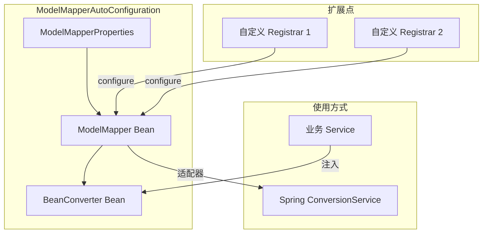

# ModelMapper Spring 集成实现方案

## 目标

在 `framework-infra` 模块中添加 ModelMapper 的 Spring Boot 自动配置，实现：

- ModelMapper Bean 的自动装配
- BeanConverter 通用转换接口
- 与 Spring ConversionService 的集成
- 自定义映射规则扩展点
- 完整的单元测试

## 文件结构

```
framework-infra/src/main/java/top/sephy/infra/modelmapper/
├── BeanConverter.java                    # 通用转换接口
├── ModelMapperBeanConverter.java         # BeanConverter 实现
├── ModelMapperConverter.java             # Spring Converter 适配器
├── ModelMapperConverterRegistrar.java    # 自定义映射注册接口
├── ModelMapperProperties.java            # 配置属性类
└── ModelMapperAutoConfiguration.java     # 自动配置类

framework-infra/src/main/resources/
└── META-INF/spring/
    └── org.springframework.boot.autoconfigure.AutoConfiguration.imports

framework-infra/src/test/java/top/sephy/infra/modelmapper/
└── ModelMapperAutoConfigurationTest.java  # 测试用例
```

## 实现步骤

### 1. 添加 Maven 依赖

在 [framework-dependencies/pom.xml](framework-dependencies/pom.xml) 中：

**properties 部分添加：**

```xml
<modelmapper.version>3.2.0</modelmapper.version>
```

**dependencyManagement 部分添加：**

```xml
<dependency>
    <groupId>org.modelmapper</groupId>
    <artifactId>modelmapper</artifactId>
    <version>${modelmapper.version}</version>
</dependency>
```

在 [framework-infra/pom.xml](framework-infra/pom.xml) 的 dependencies 中添加：

```xml
<dependency>
    <groupId>org.modelmapper</groupId>
    <artifactId>modelmapper</artifactId>
    <scope>provided</scope>
</dependency>
```

### 2. 创建核心类

#### 2.1 BeanConverter.java - 通用转换接口

- 提供 `convert(source, targetType)` 单对象转换
- 提供 `convertList(sources, targetType)` 集合转换
- 提供 `copyProperties(source, destination)` 属性复制

#### 2.2 ModelMapperBeanConverter.java - 实现类

- 封装 ModelMapper 实例
- 实现 BeanConverter 接口的所有方法

#### 2.3 ModelMapperConverter.java - Spring Converter 适配器

- 实现 `org.springframework.core.convert.converter.Converter` 接口
- 用于注册到 Spring ConversionService

#### 2.4 ModelMapperConverterRegistrar.java - 扩展接口

- 提供 `configure(ModelMapper)` 方法
- 允许用户自定义映射规则

#### 2.5 ModelMapperProperties.java - 配置属性

- 匹配策略：STANDARD, STRICT, LOOSE
- 字段匹配、歧义忽略、跳过空值等配置

#### 2.6 ModelMapperAutoConfiguration.java - 自动配置

- 创建 ModelMapper Bean
- 创建 BeanConverter Bean
- 自动扫描并应用 ModelMapperConverterRegistrar
- 可选的 ConversionService 集成

### 3. 创建 Spring Boot 自动配置注册文件

在 `src/main/resources/META-INF/spring/org.springframework.boot.autoconfigure.AutoConfiguration.imports` 中注册配置类。

### 4. 编写测试用例

测试内容：

- ModelMapper Bean 自动装配
- BeanConverter 基本转换功能
- 集合转换功能
- 自定义 ModelMapperConverterRegistrar 生效
- 配置属性生效（STRICT 模式等）
- 嵌套对象转换

## 架构图



## 配置示例

```yaml
infra:
  modelmapper:
    matching-strategy: STRICT
    field-matching-enabled: true
    ambiguity-ignored: true
    skip-null-enabled: true
```
